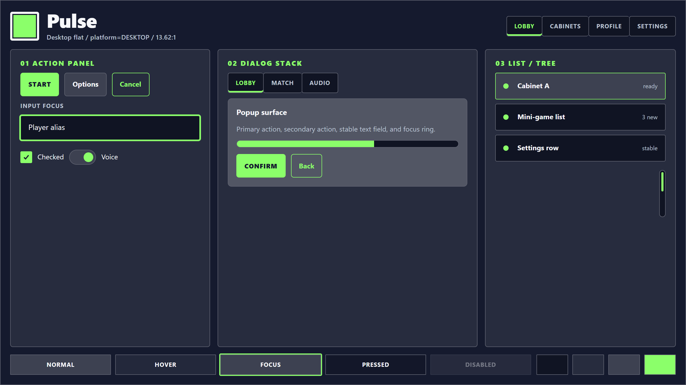

# Mockup Revision 2 Handoff — Raised Semantics, Mood Variety, Slideshow

**Status:** Plan 02 has been re-rendered once (commit `41f2723`) and the user accepts the architectural direction (single concrete `NeoCadeTheme` class + N data-only `.tres`, luminance-derived dark/light, 9 `@export` properties). The PNGs pass D-29 (10 axes vary) and D-30 (greyscale sufficiency). However, the user reviewed the rendered output and reports five remaining problems. This handoff drives a revision-2 render pass to fix them.

**Supersedes (extends, does not replace):** `GALLERY-LAYOUT-HANDOFF.md` (the vertical-stack reflow from the prior handoff is still wanted; this handoff adds to it). Apply both.

**Read these references before starting:**

- `.planning/mockups/concepts/*.png` — the v0 atmospheric concept images (Midnight Marquee, Boardwalk Sunset, Cabinet Chrome, Prize Pop Plaza, Orbital Playdeck). The user says "compare the current mockups with these and see how widely different each one was." They want the v1 mockups to carry the same level of categorical mood differentiation — minus the textures, painterly chrome, and 3D depth that got rejected at the v0 gate. Look at all five.
- The user's reference for raised buttons: the [hcgamestudios.itch.io flat-game-ui-for-mobile-games](https://hcgamestudios.itch.io/flat-game-ui-for-mobile-games) and [fajrulaslim.itch.io UI Button Flat Design](https://fajrulaslim.itch.io/ui-button-flat-design/devlog/157464/ui-button-flat-design) pages. Use WebFetch to view the pages and inspect the example images. **Look specifically at how the bottom edge of raised buttons is colored — it is a darker variant of the button's own color, never black.**
- The user's original v0 feedback (paraphrased): liked the colors of Midnight Marquee, Cabinet Chrome, Orbital Playdeck; loved Prize Pop Plaza's childish/friendly mobile-game vibe and especially its raised tactility ("simple 3D interactables with the colorful fill"); thought Orbital Playdeck was the safest with iOS-like rounding. Wants ALL of that personality range preserved, just rendered flat-without-textures.

## TL;DR — six issues

| # | Issue | Root cause |
|---|---|---|
| 1 | Raised mode applies too narrowly (only primary buttons + selected tabs/rows) | The `--raised-X-offset` tokens in `src/neocade-mockups.css` are scoped to specific selectors only. The user wants raised to apply broadly — most interactables (buttons of all roles, panels, chips, brand mark) should lift in raised mode, with a small explicit "do-not-raise" matrix (passive elements). |
| 2 | Raised bottom edge looks black (Neobrutalism) | `src/neocade-mockups.js` `deriveSurfaceRamp()` returns `offset: mix(base, "#000000", 0.55)` — that single near-black token is used for every raised element regardless of its own background color. The user's reference image is a pink button with a darker-pink (same hue) bottom edge. Fix: each raised element's offset must be a darker variant of THAT element's background, not the page base. |
| 3 | Corner radii too clustered (5/11/13/16/18) | The 5 directions are within a 13px range, which the user finds insufficiently varied. They want at least one direction with **0px corners** (truly sharp/arcade) and a much wider spread, plus more categorical shape variety (e.g., one direction's primary button is fully-pill, another is rectangular with sharp corners). |
| 4 | `concept-gallery.html` is hard to A/B compare | No way to flip directly between two directions for instant comparison. The user wants a **slideshow** at the top of the gallery: a big desktop image, left/right arrow keys cycle through the 5 directions, **no transition** (instant swap so visual differences are obvious). |
| 5 | Mood variety hasn't matched the v0 categorical distinction | Even with shape-language differentiation, the directions still feel like "the same UI in different colors with slightly different radii." The user wants every direction to feel like a **different room in the arcade**, comparable to the v0 atmospheric concepts but flat. |
| 6 | Desktop and mobile mockups look the same size — platform sizing is actually inverted | `PLATFORM_TOKENS` in `src/neocade-mockups.js` has `desktop: {buttonMin:44, body:14}` and `mobile: {buttonMin:48, body:13}` — mobile body text is SMALLER than desktop (backwards from iOS HIG / Material 3 guidance). The CSS at `.nc-artboard.mobile` actually SHRINKS mobile controls (button 46→42px, input 44→40px, toggle 24→20px). Result: a viewer can't tell which mockup is mobile and which is desktop. The user wants the difference to be **immediately visible**: mobile = iOS/Android tap-target floors with larger body text; desktop = compact game-UI density. |

## Issue 1 — Broad raised semantics with explicit do-not-raise matrix

When `raised=true`, the following controls SHOULD raise (have a hard down-shadow offset):

| Control | Raise? | Why |
|---|---|---|
| Primary button (Start, Confirm) | YES | The hero interactable; user's PLAY-button reference |
| Secondary button (Options) | YES | Still an interactable surface |
| Ghost / outline button (Cancel, Back) | YES | Still an interactable surface |
| Selected tab | YES | Active state lifts off the bar |
| Unselected tab | YES (smaller offset) | Tabs are interactable; lift them subtly |
| Selected list/tree row | YES | Active row lifts |
| Action panel container | YES | Panels are surfaces — user explicitly said panels should be raised |
| Dialog stack container | YES | Same reasoning |
| List/tree container | YES | Same reasoning |
| Popup/dialog overlay | YES (largest offset) | Modal overlays sit highest |
| Brand-mark badge | YES | It's a visible affordance — let it sit on the page |
| Chip/segmented control | YES | Interactable |
| Toggle switch (track + thumb) | YES (small offset on the thumb) | Thumb lifts; track stays flat |
| Checkbox | YES (small offset on the box when checked) | Active state lifts |
| Progress bar fill | YES (small offset on the fill) | Active fill lifts |

Controls that SHOULD NOT raise (stay flat regardless of `raised=true`):

| Control | Why NOT |
|---|---|
| Text input (LineEdit) | Inputs read as recessed/inset — raising them feels wrong |
| Passive labels (kicker, body text) | Not interactable, not surfaces |
| Section headers ("01 ACTION PANEL") | Type only, not chrome |
| Scrollbar track | Stays in-panel |
| Scrollbar grabber | Subtle accent, no need to raise |
| Separators / dividers | Lines, not surfaces |
| Unselected list/tree row | Stays in panel; only selected row lifts |
| Focus ring | Already provides emphasis via thickness/color |
| State strip "swatches" at bottom (normal/hover/focus/pressed/disabled labels) | These are demo labels in the artboard, not real controls |

**Implementation:** Generalize the raised-mode CSS to hit the broad set above. Suggested approach: define a single `--raise-strength` token per direction, then a smaller set of selector-scoped offsets (e.g., `--raise-button` = `--raise-strength`, `--raise-panel` = `--raise-strength`, `--raise-dialog` = `--raise-strength * 1.3`, `--raise-thumb` = `--raise-strength * 0.5`). Apply via `box-shadow: 0 var(--raise-X) 0 0 var(--X-offset)` on each surface type when the artboard has the `mode-raised` class.

The user noted "raised should be raised for nearly all controls and based on a matrix to know which objects should avoid being raised." — so document the matrix above (or a final version of it) somewhere visible. Consider adding it as a comment block in `src/neocade-mockups.css` near the raised-mode rules.

## Issue 2 — Raised offset must be a darker variant of the element's own background, not page base

This is the biggest visual problem. Currently, every raised element uses ONE `--offset` token computed as `mix(base_color, #000000, 0.55)` — i.e., the page base mixed with 55% black. That produces a near-black bottom edge regardless of what the raised element's own color is. The user calls this "Neobrutalism" and rejects it.

**Correct rule (per the user's reference image):** the bottom edge of a raised element is **the same hue as the element's bg, just ~20-25% darker in lightness**. On a pink button (#FFB3E6) the offset is a darker pink (~#CC8BB8), not black. On a green button (#8BFF6A) it's a darker green (~#5EC93F).

### Fix

In `src/neocade-mockups.js` `deriveSurfaceRamp()` and `deriveTokens()`:

1. Replace the single `offset` token with **per-color offset tokens**, one for every fill the artboard uses:
   - `--accent-offset` = `darken(accent_color, 22%)` — used by primary buttons (bg = accent)
   - `--surface-high-offset` = `darken(surface_high, 22%)` — used by secondary buttons, ghost buttons, unselected tabs, brand-mark badge, selected row (bg = surface-high)
   - `--surface-panel-offset` = `darken(surface_panel, 22%)` — used by container panels (bg = surface-panel)
   - `--surface-overlay-offset` = `darken(surface_overlay, 18%)` — used by dialog overlay (bg = surface-overlay)
   - `--surface-low-offset` = `darken(surface_low, 22%)` — used by inputs IF they raise (they shouldn't per Issue 1, but the token is cheap to expose)

2. Add a `darken(hexColor, percent)` helper. HSL conversion is the cleanest approach: parse hex → convert to HSL → reduce L by `percent` → convert back. Or use `mix(hex, '#000000', percent)` ONLY if the result still reads as "same hue, darker" — in practice mix-with-black often dulls the hue, so HSL lightness reduction is preferred.

3. Update each raised CSS rule to use the per-element offset token, not the global `--offset`:
   - `.mode-raised .nc-art-button.primary { box-shadow: 0 var(--raise-button) 0 0 var(--accent-offset); }`
   - `.mode-raised .nc-art-button { box-shadow: 0 var(--raise-button) 0 0 var(--surface-high-offset); }` (default for ghost/secondary)
   - `.mode-raised .nc-art-card { box-shadow: 0 var(--raise-panel) 0 0 var(--surface-panel-offset); }`
   - `.mode-raised .nc-art-dialog { box-shadow: 0 var(--raise-dialog) 0 0 var(--surface-overlay-offset); }`
   - …and so on for tabs, chips, brand mark, toggle thumb, etc.

4. Optional but recommended: add a subtle 1px lighter top rim on raised primary buttons to match the user's reference image (the PLAY button has a slight inner highlight at its top edge). `box-shadow: 0 var(--raise-button) 0 0 var(--accent-offset), inset 0 1px 0 0 color-mix(in srgb, var(--accent) 50%, white);`. This is the "extruded flat 3D" look done well.

### Expected result per direction (raised=true)

The PNG should look like a colorful candy machine, not a Neobrutalism poster. Each direction's raised primary button should have a bottom edge that's **clearly the same hue as the button face**, just darker. Confirm by zooming into the rendered PNG and checking that the bottom edge of `Start` (primary) reads as "darker green / darker blue / darker pink / darker mint / darker gold" matching the direction's accent.

## Issue 3 — Wider corner-radius variety + categorical shape spread

The current spread (5/11/13/16/18 px) is too narrow. **Use this revised set as a starting point**, then refine to taste:

| Direction | corner_radius | mood justification |
|---|---|---|
| **Pulse** | **0** | Cabinet bezels are SHARP. Arcade hardware has square edges. Zero radius is the most cabinet thing we can do. |
| **Slate** | **14** | iOS-app style — slightly bigger than current 11px to lean more "premium iPhone settings panel." |
| **Bubble** | **26** | Bigger than current 18px. Genuinely bubbly. Combined with the raised-strength fix, this should feel like candy. |
| **Daybreak** | **8** | Subtle softness — let "airy spacing + bright mint accent + halo" carry the daylight mood, not big radius. |
| **Burst** | **18** | Bold but not extreme. The drama comes from oversized primary radius (`r_button_primary` = 26+), asymmetric tab, chunky brand mark — not from base radius. |

Spread is now 0–26 (26px range) instead of 5–18 (13px range). Twice the variety.

### Categorical shape variety per axis

Beyond the radius scalar, push categorical differences harder:

| Axis | Pulse | Slate | Bubble | Daybreak | Burst |
|---|---|---|---|---|---|
| Tab shape | rectangular flush strip, 0px | pill 999px | pill 999px (large) | rounded-rect 8px with mint halo | rounded-rect 16px, **selected tab visibly taller and wider** |
| Brand mark | square 0px with thick green border (cabinet bezel) | rounded square 14px, no border | **circle 50%** with halo | rounded square 8px with mint halo aura | **chunky asymmetric badge**, slight tilt, thick gold border |
| Primary button shape | rectangular 0px (sharp cabinet button) | pill 999px or 14px | pill 999px (fully rounded) | 8px soft rect | oversized 22-28px (visibly larger than other buttons) |
| Ghost button | sharp 0px with 2px green outline | pill outline | pill outline thicker | 8px outline | rounded outline |

The point: a colorblind reviewer should be able to tell the directions apart by **which shapes they use**, not just by how rounded those shapes are. Pulse should look like there's no rounding ANYWHERE; Bubble should look like everything is a pill or circle; Burst should look asymmetrically oversized; etc.

### Update `data/directions.json` shape_language blocks

The shape blocks at `data/directions.json` are the source of truth. Update each direction's:

- `axis_1_corner_radius_base_px` — use the values above (Pulse: 0, Slate: 14, Bubble: 26, Daybreak: 8, Burst: 18).
- `axis_1_corner_radius_chip_px` — Pulse 0, Slate 999, Bubble 999, Daybreak 8, Burst 16.
- `axis_2_button_radius_px` — match the table above.
- `axis_2_primary_button_radius_px` — Burst's primary is 26-28; others equal to button radius.
- `axis_4_brand_mark_radius_px` — Pulse 0, Slate 14, Bubble 999 (circle), Daybreak 8, Burst 16.
- `axis_4_brand_mark_shape` — keep enum names but make sure Pulse=square-cabinet-bezel, Bubble=circle, Burst=chunky-asymmetric-badge are visibly distinct in render.

Mirror the values into the JS `NEOCADE_DIRECTIONS[*].shape` block so the file:// renderer picks them up.

## Issue 4 — Slideshow comparison view at top of `concept-gallery.html`

Add a slideshow component to the top of the gallery that lets the user toggle through the 5 desktop-flat images instantly via left/right arrow keys (or click controls).

### HTML structure to insert

After the `<header class="nc-header">` block, before the `<section class="nc-legend">` block:

```html
<section class="nc-slideshow" data-slideshow aria-label="Direction comparison slideshow">
  <div class="nc-slideshow-frame">
    <button class="nc-slideshow-arrow" data-slideshow-prev aria-label="Previous direction">‹</button>
    <figure class="nc-slideshow-stage">
      
      <figcaption data-slideshow-caption>
        <span data-slideshow-name>Pulse</span>
        <span data-slideshow-mood>cabinet control panel</span>
      </figcaption>
    </figure>
    <button class="nc-slideshow-arrow" data-slideshow-next aria-label="Next direction">›</button>
  </div>
  <div class="nc-slideshow-tabs" data-slideshow-tabs role="tablist">
    <!-- tabs populated by JS, one per direction; aria-selected on current -->
  </div>
  <p class="nc-slideshow-hint">Press <kbd>←</kbd>/<kbd>→</kbd> or click a name to swap. Switches are instant — no transition — so you can A/B compare moods quickly.</p>
</section>
```

### CSS rules

Add to `src/neocade-mockups.css`. The hard requirement is **no transitions on the image**:

```css
.nc-slideshow {
  display: grid;
  gap: 12px;
  margin: 24px 0;
  padding: 24px;
  background: var(--panel);
  border: 1px solid var(--line);
  border-radius: 8px;
}
.nc-slideshow-frame {
  display: grid;
  grid-template-columns: auto 1fr auto;
  align-items: center;
  gap: 16px;
}
.nc-slideshow-stage {
  margin: 0;
  display: grid;
  gap: 12px;
  justify-items: center;
}
.nc-slideshow-stage img {
  display: block;
  width: 100%;
  max-width: 1280px;
  aspect-ratio: 16 / 9;
  border: 1px solid var(--line);
  border-radius: 8px;
  background: var(--panel-high);
  /* CRITICAL: no transition. The user wants instant flips for A/B comparison. */
  transition: none !important;
}
.nc-slideshow-stage figcaption {
  display: flex;
  gap: 12px;
  align-items: baseline;
  font-size: 1rem;
}
.nc-slideshow-stage figcaption [data-slideshow-name] {
  font-weight: 800;
  font-size: 1.15rem;
}
.nc-slideshow-stage figcaption [data-slideshow-mood] {
  color: var(--muted);
  font-style: italic;
}
.nc-slideshow-arrow {
  width: 48px; height: 48px;
  border-radius: 999px;
  border: 1px solid var(--line);
  background: var(--panel-high);
  color: var(--ink);
  font-size: 1.6rem;
  cursor: pointer;
}
.nc-slideshow-arrow:hover { background: var(--panel); }
.nc-slideshow-arrow:focus-visible { outline: 2px solid var(--focus); outline-offset: 2px; }
.nc-slideshow-tabs {
  display: flex;
  gap: 8px;
  flex-wrap: wrap;
  justify-content: center;
}
.nc-slideshow-tabs button {
  padding: 6px 14px;
  border-radius: 999px;
  border: 1px solid var(--line);
  background: transparent;
  color: var(--muted);
  cursor: pointer;
  font-weight: 700;
}
.nc-slideshow-tabs button[aria-selected="true"] {
  background: var(--focus);
  color: #0c0f15;
  border-color: transparent;
}
.nc-slideshow-hint { color: var(--muted); margin: 0; font-size: 0.88rem; text-align: center; }
.nc-slideshow-hint kbd {
  background: var(--panel-high);
  border: 1px solid var(--line);
  border-radius: 4px;
  padding: 2px 6px;
  font-family: inherit;
  font-size: 0.85em;
}
```

### JS behavior

Add to `src/neocade-mockups.js` (a new function, called from `boot()` if `[data-slideshow]` exists in DOM):

```javascript
function bindSlideshow() {
  const root = document.querySelector("[data-slideshow]");
  if (!root) return;

  const directions = NEOCADE_DIRECTIONS;
  const moods = {
    Pulse: "cabinet control panel",
    Slate: "premium tool app",
    Bubble: "cozy mobile game",
    Daybreak: "community lobby",
    Burst: "achievement screen"
  };
  let i = 0;
  const img = root.querySelector("[data-slideshow-image]");
  const name = root.querySelector("[data-slideshow-name]");
  const mood = root.querySelector("[data-slideshow-mood]");
  const tabs = root.querySelector("[data-slideshow-tabs]");

  // Build tabs once
  directions.forEach((d, idx) => {
    const b = document.createElement("button");
    b.type = "button";
    b.role = "tab";
    b.textContent = d.name;
    b.dataset.index = String(idx);
    b.addEventListener("click", () => set(idx));
    tabs.appendChild(b);
  });

  function set(next) {
    i = (next + directions.length) % directions.length;
    const d = directions[i];
    // Swap src directly — browser caches all 5 PNGs after first paint, so swaps are instant.
    img.src = `concepts/${d.tres_filename_stem}-desktop-flat.png`;
    img.alt = `${d.name} desktop flat mockup — ${moods[d.name] || ""}`;
    name.textContent = d.name;
    mood.textContent = moods[d.name] || "";
    tabs.querySelectorAll("button").forEach((b, idx) => {
      b.setAttribute("aria-selected", String(idx === i));
    });
  }

  root.querySelector("[data-slideshow-prev]").addEventListener("click", () => set(i - 1));
  root.querySelector("[data-slideshow-next]").addEventListener("click", () => set(i + 1));

  // Global keyboard shortcuts (only when not in an input)
  document.addEventListener("keydown", (e) => {
    if (e.target.matches("input, textarea")) return;
    if (e.key === "ArrowLeft")  { e.preventDefault(); set(i - 1); }
    if (e.key === "ArrowRight") { e.preventDefault(); set(i + 1); }
  });

  // Pre-load all 5 desktop PNGs so future swaps are instant.
  directions.forEach((d) => {
    const pre = new Image();
    pre.src = `concepts/${d.tres_filename_stem}-desktop-flat.png`;
  });

  set(0);
}
```

Wire it from `boot()`:

```javascript
function boot() {
  const page = document.querySelector("[data-gallery]");
  if (!page) return;
  if (page.dataset.gallery === "concept") {
    renderConceptGallery();
    bindSlideshow();   // ← add
  }
  if (page.dataset.gallery === "concept-image") renderConceptImage();
  if (page.dataset.gallery === "finalist") renderFinalistPlaceholder();
}
```

## Issue 5 — Mood differentiation: match v0's level of mood variation between directions

The user's framing (paraphrased): "v0 had all kinds of unique theme directions and heavy mood variations. I want that level of variation back, just without textures and 3D depth." The v0 atmospheric concepts (in `.planning/mockups/concepts/`) had radically different vibes per direction — each one was instantly recognizable as its own world. The user does NOT want to copy any specific reference (LDtk, iOS, Steam, etc.); the mood-target anchors per direction below are *inspirational compass points*, not imitation contracts. Aim for "5 directions that feel like 5 different products" — that's the bar.

Concrete bar to clear: a viewer scrolling through the 5 desktop-flat mockups should be able to articulate, in one phrase per direction, what kind of *vibe* each one has — and those phrases should be meaningfully different. If two directions get described with overlapping language (e.g., "polished dark UI" applies to both Slate and Pulse), differentiation needs to push harder.

The current v1 mockups capture some of that personality through type weight, brand-mark shape, and chip shape — but the user feels they're still too uniform. After applying issues 1-3, do a final mood pass:

- **Pulse**: Sharp 0px corners + UPPERCASE TRACKED labels everywhere + lit-cabinet primary button + raised buttons that feel like they have a real stop position when pressed. Should look like a cabinet's control panel from a 1985 arcade.
- **Slate**: 14px iOS rounding + sentence-case mixed type + extremely sparse accent (only on focus, primary fill, and selection — nowhere else) + restrained raised offset (small). Should look like the Settings panel of a high-end iPhone app.
- **Bubble**: 26px bubbly + circle brand mark + fully-pill everything + biggest raised offset + bouncy state delta. The PLAY-button-from-the-user's-reference vibe. Should look like the home screen of a cozy mobile candy game.
- **Daybreak**: 8px subtle + halo decorations behind selected tab and brand mark + airiest spacing + sentence-case kickers. Should look like a community center's check-in kiosk on a sunny afternoon.
- **Burst**: 18px bold + asymmetric tilted brand-mark badge + visibly oversized primary button (22-28px radius) + asymmetrically wider selected tab + biggest type weights. Should look like an achievement-unlock screen or a hero-event launcher.

After re-rendering, run the greyscale sufficiency test again (`screenshots/greyscale-sufficiency-test.png`) and verify that each direction reads as the right MOOD, not just "the small-radius one" / "the round one." If two directions start to read as the same mood in greyscale, push their categorical differentiation harder.

## Issue 6 — Desktop and mobile must visibly follow their platform's sizing guidelines

The current `PLATFORM_TOKENS` and `.nc-artboard.mobile` CSS overrides are inverted relative to iOS HIG, Android Material 3, and desktop game-UI conventions. Result: at the rendered PNG resolution the viewer can't tell which artboard is which platform. The user wants this difference to be **obvious at a glance** — mobile mockups should look like a tappable iOS / Android app (big targets, larger body text, generous breathing room), and desktop mockups should look like a compact game launcher / Steam-style tool panel (denser chrome, more information per screen).

### Reference standards (cited)

**Mobile — match Material Design 3 component specs.** Material Design is fundamentally a mobile-first design system; mobile mockups should embody MD3 component values directly. iOS HIG is the secondary reference for cross-platform parity (the floors are similar; we always pick whichever is larger so a single mobile artboard satisfies both OSes).

Use WebFetch or context7 to verify current values before committing. Authoritative sources at the time this handoff was written:

| Component | Material 3 spec (primary) | iOS HIG (secondary) | NeoCade mobile token |
|---|---|---|---|
| Tap target floor | **48 dp** (Material density + WCAG 2.5.5 AAA) | **44 pt** (HIG since iOS 7) | **48 dp** (`buttonMin: 48`) — covers both |
| Standard button height | **40 dp** visual + 4 dp top/bottom touch padding = 48 dp target | **44 pt** | **48 dp** as combined visual+target |
| Emphasis / Extended FAB | **56 dp** (Extended FAB) | n/a — HIG just makes hero buttons taller | **56 dp** (`primaryButtonMin: 56`) |
| Filled text field | **56 dp** (M3 default) | ~44-50 pt | **56 dp** (`inputMin: 56`) |
| List item (one-line) | **56 dp** (M3 list-item-one-line) | 44 pt (UITableViewCell default) | **56 dp** (`rowMin: 56`) |
| Switch | **32 dp** track height, ~52 dp track width (M3 Switch) | ~31×51 pt (UISwitch) | **32 dp** (`toggleMin: 32`) |
| Checkbox | 18 dp box inside 48 dp target (M3) | 24×24 pt typical | **20 dp** visible box, 48 dp target via padding (`checkboxSize: 20`) |
| Tab | **48 dp** (M3 Tabs) | 44 pt | **48 dp** (`tabMin: 48`) |
| Body text | **16 sp** (M3 Body Large) | **17 pt body** (≈ 17px @1x) | **16 px** (`body: 16`) |
| Label text | **14 sp** (M3 Label Medium) | 13 pt (HIG Caption 1 / Footnote) | **14 px** (`label_: 14`) |
| Title heading | **22 sp** (M3 Title Large) | 17-22 pt typical | **22 px** (`h2: 22`) |
| Display heading | **32 sp** (M3 Headline Large) | 28-34 pt | **32 px** (`h1: 32`) |
| Inter-control gap on `space.4+` | M3 8/12/16 dp scale; "+50%" mobile guidance from PROJECT.md architecture revision 2026-05-04 | similar | **densityScale: 1.5** on mobile |

Material 3 reference URLs to verify against:
- https://m3.material.io/foundations/accessible-design/accessibility-basics (tap targets)
- https://m3.material.io/components/buttons/specs (button heights)
- https://m3.material.io/components/text-fields/specs (text field heights)
- https://m3.material.io/components/lists/specs (list item heights)
- https://m3.material.io/styles/typography/type-scale-tokens (type scale)

iOS HIG references:
- https://developer.apple.com/design/human-interface-guidelines/buttons
- https://developer.apple.com/design/human-interface-guidelines/typography

**Desktop — match standard desktop game UI conventions.** Reference points the user is comfortable with as "standard for a desktop game":

| Reference | Button (chrome) | Primary / hero button | Body text | List row | Notes |
|---|---|---|---|---|---|
| Steam client (settings, library) | ~28-32 px | ~40 px (e.g. Install) | 14 px | ~36 px | Most influential desktop-game UI; sets community expectation |
| Battle.net launcher | ~32-36 px | ~44-48 px (Play) | 14-15 px | ~40 px | Big-screen-friendly hero buttons |
| Epic Games Launcher | ~36-40 px | ~44 px | 15-16 px | ~40 px | Slightly larger overall than Steam |
| Discord | ~32 px | ~36-40 px | 14-15 px | ~36 px | Chat-app dense |
| Godot editor | ~22-28 px | ~28 px | 13-14 px | ~26 px | Tooling — most compact end |
| In-game menus (Civ, Stardew, Hades) | ~40-48 px | ~48-56 px | 16-18 px | ~44 px | Played at distance / with controllers; bigger than chrome |
| **NeoCade desktop token** | **36 px** (`buttonMin: 36`) | **44 px** (`primaryButtonMin: 44`) | **14 px** (`body: 14`) | **36 px** (`rowMin: 36`) | Sits in the middle of the "professional desktop game UI" range — works for both editor tooling and game runtime contexts. |

Desktop NeoCade rationale: the theme has to work both for game-dev editor tooling (Godot inspector panels, custom tools) AND game-runtime UI (settings screens, lobby UI, pause menus). Steam-comparable density (36 px standard, 44 px primary) hits the sweet spot — not as compact as a pure editor tool, not as oversized as a console-first in-game menu.

### Token values to commit

In `src/neocade-mockups.js`, replace `PLATFORM_TOKENS`. Values below are pulled from the cited standards table — keep them aligned if you tweak.

```js
const PLATFORM_TOKENS = {
  desktop: {
    // Standard desktop game UI per Steam / Battle.net / Epic conventions.
    // Sits in the middle of the "professional desktop game UI" range.
    label: "platform=DESKTOP",
    buttonMin: 36,           // Steam settings buttons + Battle.net default chrome
    primaryButtonMin: 44,    // Battle.net Play / Steam Install hero button
    inputMin: 34,            // Steam-style search/filter input
    toggleMin: 22,           // Steam-comparable: small but visible
    checkboxSize: 18,        // standard desktop checkbox
    body: 14,                // Steam / Discord / Battle.net body
    label_: 12,              // smaller secondary labels (kicker, helper text)
    h1: 36,
    h2: 22,
    kicker: 12,
    rowMin: 36,              // Steam list-row density
    tabMin: 32,
    tapPadding: 8,
    densityScale: 1.0
  },
  mobile: {
    // Material Design 3 component spec values; iOS HIG covered by always
    // picking the larger of the two floors (Material wins on every axis here).
    label: "platform=MOBILE",
    buttonMin: 48,           // M3 tap-target floor + WCAG 2.5.5 (AAA) + iOS HIG 44pt
    primaryButtonMin: 56,    // M3 Extended FAB height — primary-action emphasis
    inputMin: 56,            // M3 filled text field default
    toggleMin: 32,           // M3 Switch track height
    checkboxSize: 20,        // M3 visible box; full 48dp target via tapPadding
    body: 16,                // M3 Body Large (≈ iOS 17pt body @1x)
    label_: 14,              // M3 Label Medium (≈ iOS Footnote)
    h1: 32,                  // M3 Headline Large
    h2: 22,                  // M3 Title Large
    kicker: 13,              // M3 Label Small
    rowMin: 56,              // M3 list-item-one-line
    tabMin: 48,              // M3 Tabs default
    tapPadding: 12,          // hit-area expansion around small interactives
    densityScale: 1.5        // +50% inter-control gap on space.4+ (per architecture revision 2026-05-04)
  }
};
```

Also expose these to CSS as variables in `deriveTokens()`:

```js
"--button-min": `${platform.buttonMin}px`,
"--button-min-primary": `${platform.primaryButtonMin}px`,
"--input-min": `${platform.inputMin}px`,
"--toggle-min": `${platform.toggleMin}px`,
"--checkbox-size": `${platform.checkboxSize}px`,
"--body-size": `${platform.body}px`,
"--label-size": `${platform.label_}px`,
"--h1-size": `${platform.h1}px`,
"--h2-size": `${platform.h2}px`,
"--kicker-size": `${platform.kicker}px`,
"--row-min": `${platform.rowMin}px`,
"--tab-min": `${platform.tabMin}px`,
"--tap-padding": `${platform.tapPadding}px`,
"--density-scale": String(platform.densityScale),
```

### CSS overhaul

The `.nc-artboard.mobile` block in `src/neocade-mockups.css` currently overrides the desktop defaults DOWNWARD (mobile button 42, input 40, toggle 20). **Reverse this.** The base rules should target the COMMON artboard (using the new CSS variables for sizing), and `.nc-artboard.mobile` overrides where needed should bump values UP, not down.

Suggested approach:

```css
/* Base — desktop sizing assumed as default; consumed by both desktop and mobile artboards. */
.nc-art-button {
  min-height: var(--button-min);
  font-size: var(--body-size);
  padding-inline: calc(var(--button-pad-h) * 1px);
  padding-block: calc(var(--button-pad-v) * 1px);
}
.nc-art-button.primary {
  min-height: var(--button-min-primary);
}
.nc-art-input {
  min-height: var(--input-min);
  font-size: var(--body-size);
}
.nc-art-toggle .nc-track {
  min-width: calc(var(--toggle-min) * 1.6);
  min-height: var(--toggle-min);
}
.nc-art-checkbox {
  width: var(--checkbox-size);
  height: var(--checkbox-size);
}
.nc-art-list-row {
  min-height: var(--row-min);
}
.nc-art-tab {
  min-height: var(--tab-min);
}
/* …kicker uses --kicker-size, h1 uses --h1-size, etc. */

/* Mobile-specific tweaks — only what truly differs beyond the variable values
   (e.g. nav tab layout becomes a single-row scroll on mobile, scrollbar hides). */
.nc-artboard.mobile .nc-art-grid { grid-template-columns: 1fr; }
.nc-artboard.mobile .nc-art-scrollbar { display: none; }
.nc-artboard.mobile .nc-art-tabs { overflow-x: auto; }
```

The point: **size differences flow from CSS variables, not from explicit DOWNWARD `.mobile` overrides**. Desktop gets compact tokens; mobile gets the larger tokens; the same CSS rule produces visibly different output.

### What the user should be able to see

After re-rendering:

- Open `pulse-desktop-flat.png` and `pulse-mobile-flat.png` side by side. The mobile button heights should be **noticeably larger** (~48-56px) than desktop's (~36-42px). Mobile body text should be **noticeably larger** (~16px) than desktop's (~14px). Mobile list rows should be **noticeably taller** (~56px) than desktop's (~36px). Mobile toggles and checkboxes should be **chunkier** for thumb access.
- The same comparison should hold for every direction — Bubble's mobile primary button at 56px tall is unambiguously a mobile button; Slate's desktop primary button at 42px tall is unambiguously a desktop control.
- Inter-control gap on mobile is +50% over desktop on `space.4+` per the original 2026-05-04 architecture revision; this is what `--density-scale` is for.

### Why this matters

The `@export var platform: Platform` toggle on `NeoCadeTheme` (locked architecture) is supposed to swap the theme between three real-world targets: forced DESKTOP for desktop builds, forced MOBILE for mobile builds, AUTO for runtime detection via `OS.has_feature("mobile")`. If the mockups don't visibly differentiate desktop and mobile, the whole point of having a `platform` `@export` is unclear. After this fix, a consumer instantiating `SlateNeoCadeTheme` and flipping `platform=MOBILE` should see controls grow to tap-target size; flipping back to `DESKTOP` should see them tighten to game-launcher density.

## Files to change

| Path | Change |
|---|---|
| `src/neocade-mockups.css` | (a) Apply the vertical layout reflow from `GALLERY-LAYOUT-HANDOFF.md` if not already done. (b) Replace narrow raised selectors with broad raised matrix from Issue 1. (c) Replace single `--offset` references with per-color offset tokens from Issue 2. (d) Add slideshow CSS from Issue 4. (e) Replace `.nc-artboard.mobile` downward overrides with platform-variable-driven sizing per Issue 6 — base rules consume the new sizing variables; the mobile artboard simply gets bigger values via its `--button-min`/`--input-min`/etc. tokens. |
| `src/neocade-mockups.js` | (a) Replace `offset: mix(base, "#000000", 0.55)` in `deriveSurfaceRamp()` with per-color offsets. (b) Add `darken(hex, pct)` helper. (c) Add new offset tokens to `deriveTokens()` return object. (d) Add `bindSlideshow()` and call from `boot()` for the concept gallery. (e) Replace `PLATFORM_TOKENS` with the expanded desktop/mobile sizing tables from Issue 6 (correct iOS HIG / Material 3 floors on mobile, compact game-UI density on desktop) and emit all the new sizing tokens from `deriveTokens()`. |
| `data/directions.json` | Update each direction's `shape_language` block: new `corner_radius` values from Issue 3 (Pulse 0, Slate 14, Bubble 26, Daybreak 8, Burst 18), plus categorical shape-axis updates. |
| `concept-gallery.html` | Insert the `<section class="nc-slideshow">` block from Issue 4 between header and legend. No other structural changes. |
| `concepts/*.png` | RE-RENDER all 15 PNGs after CSS/JS changes via `node render.js concept-images`. The shape and raised changes WILL change the rendered output. |
| `screenshots/color-overview.png` and `screenshots/greyscale-sufficiency-test.png` | RE-RENDER both audit composites via `node render.js` (default mode for color overview; rerun for greyscale per the existing render.js mode). |
| `render-check.md` | Update per-direction audit rows with the new corner_radius values and the broader raised matrix. Re-run the D-30 greyscale test and confirm PASS for each direction with the right MOOD reading. |

## What stays exactly the same

- Direction names: Pulse, Slate, Bubble, Daybreak, Burst (locked at Phase 3.3).
- Direction palettes: locked in `THEME-DIRECTIONS.md` Revision Round 2/2; no palette changes in this revision.
- The single-class `NeoCadeTheme` architecture (`PROJECT.md` Key Decisions row 2026-05-06f). The 9-`@export` set isn't expanding here either — these mockup-side changes are about HTML/CSS/JS faithfully reproducing what the architecture supports.
- Phase 3.4 corrective addendum decisions D-28 (dark only), D-29 (10-axis differentiation), D-30 (greyscale sufficiency). All still binding; this revision must continue to pass them.
- The fixed control inventory + control order in each artboard (the same-screen comparison contract from `direction-shape-language-spec.md`).
- All v0 artifacts in `.planning/mockups/concepts/` and `.planning/mockups/03-direction-boards.*` — read for reference, do not modify.

## Verification

After all changes are applied:

1. **Open `concept-gallery.html`** in a browser. Confirm:
   - Slideshow at top with one direction visible.
   - Pressing `←`/`→` flips the image instantly with **zero transition** (no fade, no slide).
   - Tab buttons under the slideshow also work for direct selection.
   - Below the slideshow: per-direction sections continue with the vertical layout from the previous handoff (desktop hero on top, mobile pair below it, brief text below).

2. **Open the 15 freshly-rendered PNGs** (`concepts/*.png`). Confirm per-direction:
   - Pulse: **0px corners everywhere**. UPPERCASE TRACKED labels. Sharp cabinet feel.
   - Slate: 14px iOS rounding, pill chips, tiny raised offset.
   - Bubble: 26px bubbly + circle brand mark + biggest raised offsets, primary button looks like the user's PLAY-button reference (darker-pink bottom edge, NOT black).
   - Daybreak: 8px soft + halo decorations + airy.
   - Burst: 18px bold with asymmetric tab + tilted brand mark + oversized primary at 22-28px.

3. **Inspect raised mode (mobile-raised PNGs)** at full resolution. For every raised element, the bottom edge color must be a darker variant of the element's own background color. Specifically zoom into Bubble's `Start` button — bottom should be a darker pink, not a near-black slab. Same check for Pulse's green primary, Slate's blue primary, Daybreak's mint primary, Burst's gold primary.

4. **Compare desktop vs mobile mockups directly** for any one direction (e.g., open `slate-desktop-flat.png` and `slate-mobile-flat.png` side by side). Confirm:
   - Mobile primary button is visibly **larger** than desktop primary (mobile ~56px tall vs desktop ~42px).
   - Mobile body text is visibly **larger** than desktop body (mobile ~16px vs desktop ~14px).
   - Mobile list rows are visibly **taller** than desktop rows (mobile ~56px vs desktop ~36px).
   - Mobile checkboxes and toggle thumbs are **chunkier** than desktop equivalents.
   - Mobile inter-control gaps are noticeably more generous than desktop (per the +50% mobile spacing rule).
   - If you can't tell which is which without reading the filename, the platform-sizing fix didn't take.

5. **Run the greyscale sufficiency test** (`node render.js` greyscale mode, or open `src/greyscale-check.html`). Confirm each direction is identifiable by SHAPE LANGUAGE alone (the test still passes), AND that each reads as the right mood (the test now passes more decisively — Pulse's 0px corners are unmistakable in greyscale; Bubble's circle and full-pill chips ditto; Burst's tilted badge ditto).

6. **Update `render-check.md`** with the revision-2 audit results — per-direction tables, mood-target reads, D-30 result, plus a new **platform-sizing audit row per direction** confirming desktop and mobile differ visibly on button/input/row/text sizes. The doc currently records revision 1's outputs; supersede those with revision 2's.

## Hard rules

- Do NOT modify direction names, palettes, or the locked architecture.
- Do NOT touch production files (`addons/`, `showcase/showcase.tscn`, `project.godot`, any `.tres` or `.gd` outside `.planning/`).
- Do NOT touch v0 historical artifacts (`.planning/mockups/concepts/`, `.planning/mockups/03-direction-boards.*`, `.planning/research/mood-board/`).
- Do NOT add textures, gradients, embossing, painterly chrome, or soft drop shadows. Hard offsets (sharp box-shadow) only. The user explicitly rejected anything "Neobrutalism" — but the cure is not "no shadows at all," it's "shadows in the same color family as the element, sharp edge."
- Do NOT change Phase 3.4 governance docs (`CORRECTIVE-ADDENDUM.md` D-28/D-29/D-30/D-31, `direction-shape-language-spec.md`) — they're correct; only the implementation needs revision.

## Commit style

When done:

```
feat(03.4-02): mockup revision 2 — broad raised, color-tinted offsets, wider radius spread, slideshow, platform sizing
```

Body should note:
- Issue 1 fix: broadened raised matrix; list which controls now raise vs which stay flat.
- Issue 2 fix: per-color offset tokens replacing single near-black `--offset`; add darken() helper.
- Issue 3 fix: new corner_radius spread (0/14/26/8/18) plus categorical shape-axis updates.
- Issue 4 fix: instant slideshow at top of concept-gallery.html.
- Issue 5 verification: D-30 greyscale test re-run + per-direction mood read.
- Issue 6 fix: corrected `PLATFORM_TOKENS` (mobile 48dp/16px floors per Material 3 + iOS HIG; desktop 36px/14px compact game-UI density); replaced `.nc-artboard.mobile` downward overrides with variable-driven sizing so mobile artboards visibly differ from desktop in button height, input height, body text, list-row height, and inter-control gap.
- Re-rendered: 15 concept PNGs + 2 audit composites.
- Updated: render-check.md per-direction tables + new platform-sizing audit row per direction.

End with the standard `Co-Authored-By: Claude Opus 4.7 (1M context) <noreply@anthropic.com>` line.

## Stop point

After re-rendering and verification, the Plan 02 user gate is **still open** at finalist-selection (Task 4 in `03.4-02-stage-1-concept-boards-and-finalist-selection-PLAN.md`). Do not auto-advance — the user reviews the revision-2 PNGs and either picks finalists or requests another revision pass.
